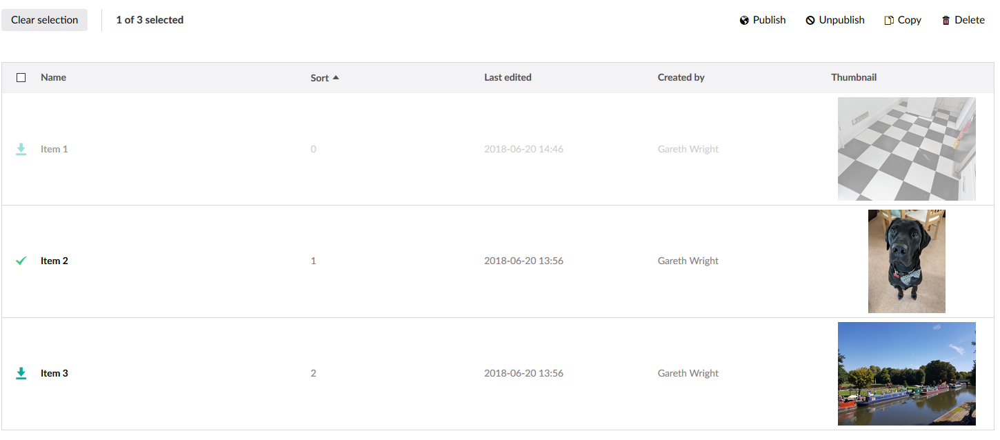

# Umbraco ThumbnailListView

A simple app_plugin for Umbraco that allows you to view a ListView with a thumbnail image.

It works with all the original functionality of ListView, including selections, sort and search. 

### Screenshot

### DataType
